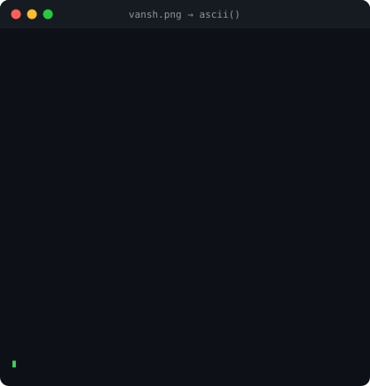

<table>
<tr>
<td width="420" valign="top">

</td>
<td valign="top">

# 💫 About Me:
👨‍💻 I'm currently working on building projects in software development and exploring practical applications of technology.  🤝 I'm looking to collaborate on interesting programming, AI/ML, and software projects.  🌱 I'm currently learning and improving my skills in programming, data structures, databases, and software development.  💬 Ask me about my Lift IQ System project, hackathons, and technology projects.  ⚡ Fun fact: I enjoy turning ideas into practical projects and participating in technical competitions.

</td>
</tr>
</table>

## 🐍 Contribution Snake

  <picture>
    <source media="(prefers-color-scheme: dark)" srcset="https://raw.githubusercontent.com/Vansh-codes-lang/Vansh-codes-lang/output/github-contribution-grid-snake-dark.svg" />
    <source media="(prefers-color-scheme: light)" srcset="https://raw.githubusercontent.com/Vansh-codes-lang/Vansh-codes-lang/output/github-contribution-grid-snake.svg" />
    
  </picture>

Generated daily by the workflow at <code>.github/workflows/snake.yml</code> → pushed to the <code>output</code> branch.

## 🌐 Socials:
   

# 💻 Tech Stack:
            
# 📊 GitHub Stats:
 
 

---

<!-- Proudly created with GPRM ( https://gprm.itsvg.in ) -->
